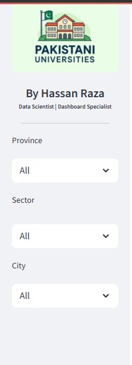
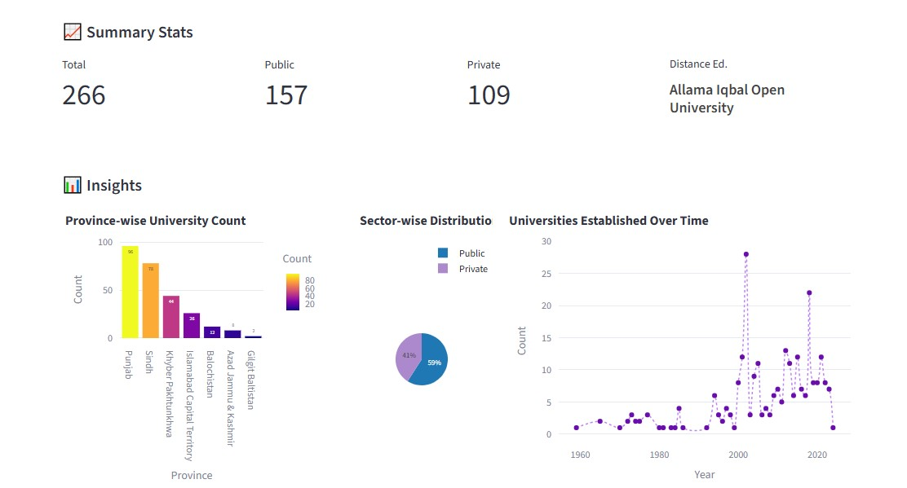
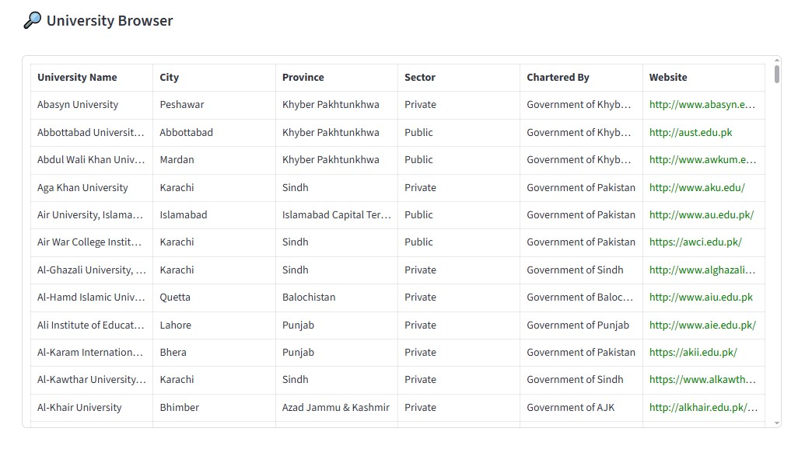

# 🇵🇰 Pakistani Universities Dashboard 🎓

An interactive and responsive data dashboard built with **Streamlit**, visualizing higher education institutions in Pakistan. Users can filter universities by **province, city, sector, and distance education**, and explore summary stats, pie/bar/line charts, and an interactive browser table.

> ✅ Built by [Hassan Raza](https://www.linkedin.com/in/hassan-raza-9651b6279/) – Data Scientist | Dashboard Specialist

---

## 🔍 Features

- 📍 Filter universities by **Province**, **City**, **Sector**, and **Distance Education**
- 📊 **Insights Section** with colorful charts:
  - Sector-wise Pie Chart (Public vs Private)
  - Province-wise Bar Chart
  - Established Timeline (Line Graph)
- 🔎 **University Browser**: search and explore detailed university records
- 🌐 Website column is **clickable** and opens in a new tab
- 💻 Clean, responsive layout with light purple theme and Streamlit widgets
- 🧠 Useful for students, education analysts, and policy makers

---

## 📸 screenshots

| Filters & Metrics | Charts | University Table |
|-------------------|--------|------------------|
|  |  |  |

---

## 🚀 Run Locally

```bash
# Clone the repository
git clone https://github.com/yourusername/pakistani-universities-dashboard.git
cd pakistani-universities-dashboard

# Install dependencies
pip install -r requirements.txt

# Run the Streamlit app
streamlit run pak_uni.py
